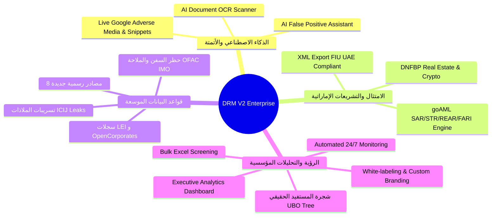

# سجل التعديلات الشامل وخطة اختبار الإصدار الثاني (V2 Enterprise Changelog & Test Plan)

---

## 📍 معلومات المسار والبيئة (Environment & Workspace Path)

| البند | البيان |
| :--- | :--- |
| **المسار الكامل للمشروع (V2 Path)** | `/Users/ahmed/Projects/serach-system-v2` |
| **فرع التطوير (Git Branch)** | `v2-enterprise` |
| **المنفذ المحلي (Local Port / URL)** | `http://localhost:3001` |
| **بيئة الإنتاج القديمة (V1 - Untouched)** | `/Users/ahmed/Projects/serach system` على منفذ `3000` |
| **قاعدة البيانات المستخدمة** | PostgreSQL `mizan` على المنفذ `55432` |

---

## 🚀 ملخص حزمة المزايا الجديدة في الإصدار الثاني (V2 Features Inventory)

تم تطوير **11 ميزة ونظام فرعي جديد بالكامل** مخصصة للإصدار المؤسسي (Enterprise Edition):

---

## 📑 تفاصيل المكونات والملفات الجديدة (Detailed Changelog)

### 1️⃣ الماسح الضوئي الذكي للمستندات والهويات (AI Document OCR Scanner)
- **الملفات**:
  - [`src/app/api/ocr/scan/route.ts`](file:///Users/ahmed/Projects/serach-system-v2/src/app/api/ocr/scan/route.ts): نقطة نهاية خلفية للمعالجة بالذكاء الاصطناعي (Gemini Vision OCR).
  - [`src/components/ocr-document-scanner.tsx`](file:///Users/ahmed/Projects/serach-system-v2/src/components/ocr-document-scanner.tsx): مكوّن واجهة المستخدم للرفع والمسح الضوئي.
- **الوظيفة**: مسح واستخراج بيانات الهوية الإماراتية (وجه/ظهر)، جوازات السفر الدولية، والرخص التجارية وملء نموذج تسجيل العميل والبحث آلياً في ثوانٍ.

### 2️⃣ مساعد استبعاد التشابه السطحي الذكي (AI False Positive Assistant)
- **الملفات**:
  - [`src/lib/ai-compliance-assistant.ts`](file:///Users/ahmed/Projects/serach-system-v2/src/lib/ai-compliance-assistant.ts): محرك تحليل التطابقات والفروقات في تاريخ الميلاد والدولة والاسم.
  - [`src/components/ai-assistant-badge.tsx`](file:///Users/ahmed/Projects/serach-system-v2/src/components/ai-assistant-badge.tsx): بطاقة التوصية الرقابية الذكية مع زر الاعتماد الفوري بنقرة واحدة.
- **الوظيفة**: اقتراح قرار الاستبعاد المبرر للمحلل مع توثيق السبب نظامياً في سجل التدقيق بنقرة واحدة.

### 3️⃣ المصادر الرسمية الـ 8 عالية القيمة (8 High-Value Official Data Sources)
- **الملفات**:
  - [`scripts/seed-high-value-sources.ts`](file:///Users/ahmed/Projects/serach-system-v2/scripts/seed-high-value-sources.ts): سكريبت توليد وحقن البيانات الرسمية في قاعدة البيانات.
  - [`src/lib/risk.ts`](file:///Users/ahmed/Projects/serach-system-v2/src/lib/risk.ts) & [`src/lib/source-categories.ts`](file:///Users/ahmed/Projects/serach-system-v2/src/lib/source-categories.ts): تصنيف وتعيين مستويات المخاطر والصلاحيات.
- **القوائم المضافة**:
  1. `ae_sca_alerts`: تنبيهات هيئة الأوراق المالية والسلع الإماراتية.
  2. `ae_dfsa_adgm_alerts`: تنبيهات سلطة دبي للخدمات المالية وأبوظبي العالمية.
  3. `sa_cma_alerts`: تنبيهات هيئة السوق المالية السعودية.
  4. `gb_fca_warnings`: تحذيرات هيئة السلوك المالي البريطانية (FCA).
  5. `ofac_sanctioned_vessels`: حظر السفن وناقلات النفط والملاحة البحرية (IMO Numbers & Shadow Fleet).
  6. `gleif_lei_registry`: سجل معرفات الكيانات القانونية الدولية (GLEIF Golden Copy - Level 2 Parents).
  7. `opencorporates_registry`: سجل الشركات العالمي وربط المدراء والمساهمين.
  8. `icij_offshore_leaks`: تسريبات الملاذات الضريبية (Panama, Paradise, Pandora Papers).

### 4️⃣ شجرة الملكية وهيكل المستفيد الحقيقي التفاعلي (Interactive UBO Tree Visualizer)
- **الملفات**:
  - [`src/lib/ubo-extractor.ts`](file:///Users/ahmed/Projects/serach-system-v2/src/lib/ubo-extractor.ts): مستخرج علاقات الشركات والملاك والشركات الأم.
  - [`src/components/ubo-hierarchy-tree.tsx`](file:///Users/ahmed/Projects/serach-system-v2/src/components/ubo-hierarchy-tree.tsx): مكوّن الشجرة البصرية التفاعلية.
  - [`src/app/(workspace)/profiles/[id]/page.tsx`](file:///Users/ahmed/Projects/serach-system-v2/src/app/(workspace)/profiles/[id]/page.tsx): تبويب `UBO & Ownership Tree` المخصص.
  - [`src/app/(workspace)/profiles/[id]/report/page.tsx`](file:///Users/ahmed/Projects/serach-system-v2/src/app/(workspace)/profiles/[id]/report/page.tsx): القسم 4 من التقرير التنفيذي الشامل.
- **الوظيفة**: رسم بياني تفاعلي يوضح الكيان المستهدف، الشركة الأم المباشرة، الشركة الأم النهائية، المستفيد الحقيقي ونسب التملك، والكيانات المرتبطة بالملاذات الضريبية.

### 5️⃣ نماذج goAML وتصدير XML المعتمد (UAE FIU goAML SAR / STR / REAR / FARI)
- **الملفات**:
  - [`src/lib/goaml.ts`](file:///Users/ahmed/Projects/serach-system-v2/src/lib/goaml.ts) & [`src/lib/goaml-types.ts`](file:///Users/ahmed/Projects/serach-system-v2/src/lib/goaml-types.ts): منطق توليد ملفات XML وJSON المطابقة لمواصفات وحدة المعلومات المالية.
  - [`src/app/api/profiles/[id]/sar-export/route.ts`](file:///Users/ahmed/Projects/serach-system-v2/src/app/api/profiles/[id]/sar-export/route.ts): مسار تنزيل ملف `XML` أو `JSON`.
  - [`src/app/(workspace)/profiles/[id]/sar/page.tsx`](file:///Users/ahmed/Projects/serach-system-v2/src/app/(workspace)/profiles/[id]/sar/page.tsx) & [`src/components/sar-filing-view.tsx`](file:///Users/ahmed/Projects/serach-system-v2/src/components/sar-filing-view.tsx): واجهة إعداد وتوثيق البلاغات.
- **الوظيفة**: إنشاء تقارير وإبلاغ الصفقات العقارية (REAR) والتدفقات النقدية والأصول الافتراضية (FARI) وتنزيل ملف `goAML XML` جاهز للرفع الفوري.

### 6️⃣ لوحة مؤشرات الامتثال والحوكمة التنفيذية (Executive KPI Dashboard)
- **الملفات**:
  - [`src/lib/analytics.ts`](file:///Users/ahmed/Projects/serach-system-v2/src/lib/analytics.ts): محرك تجميع وحساب المؤشرات والمخاطر.
  - [`src/app/(workspace)/analytics/page.tsx`](file:///Users/ahmed/Projects/serach-system-v2/src/app/(workspace)/analytics/page.tsx): صفحة لوحة القيادة.
  - [`src/components/navigation.tsx`](file:///Users/ahmed/Projects/serach-system-v2/src/components/navigation.tsx): رابط `Executive Analytics` في القائمة الجانبية.
- **الوظيفة**: عرض مؤشرات الفحص المباشرة، نسبة كفاءة الذكاء الاصطناعي، توزيع المخاطر المؤسسية، مخاطر دول FATF، وبلاغات DNFBP، وسجل التدقيق اللحظي.

### 7️⃣ تخصيص الهوية والشعار المؤسسي (White-labeling & Official Branding)
- **الملفات**:
  - [`src/lib/branding.ts`](file:///Users/ahmed/Projects/serach-system-v2/src/lib/branding.ts) & [`src/lib/branding-types.ts`](file:///Users/ahmed/Projects/serach-system-v2/src/lib/branding-types.ts): إدارة وحفظ إعدادات الهوية.
  - [`src/app/api/branding/route.ts`](file:///Users/ahmed/Projects/serach-system-v2/src/app/api/branding/route.ts): API حفظ وتحديث الشعار والبيانات.
  - [`src/components/branding-settings-card.tsx`](file:///Users/ahmed/Projects/serach-system-v2/src/components/branding-settings-card.tsx): مكوّن الإعدادات والمعاينة في صفحة `/team`.
- **الوظيفة**: رفع شعار الشركة واسم المكتب ورقم الرخصة والظهور التلقائي على ترويسة وتذييل تقارير الـ Dossier وشهادات التدقيق.

### 8️⃣ المراقبة المستمرة 24/7 وإصدار شهادات التدقيق (Automated Ongoing Monitoring & Audit Cert)
- **الملفات**:
  - [`src/app/api/cron/monitoring/route.ts`](file:///Users/ahmed/Projects/serach-system-v2/src/app/api/cron/monitoring/route.ts): Cron Endpoint للفحص الدوري التلقائي.
  - [`src/components/monitoring-toggle.tsx`](file:///Users/ahmed/Projects/serach-system-v2/src/components/monitoring-toggle.tsx): زر تفعيل/إيقاف المراقبة من ملف العميل.
  - [`src/app/(workspace)/profiles/[id]/monitoring-audit/page.tsx`](file:///Users/ahmed/Projects/serach-system-v2/src/app/(workspace)/profiles/[id]/monitoring-audit/page.tsx): شهادة الامتثال والمراقبة المستمرة الرسمية.

### 9️⃣ الفحص الجماعي عبر ملفات إكسل (Bulk Screening Module)
- **الملفات**:
  - [`src/app/(workspace)/search/bulk/page.tsx`](file:///Users/ahmed/Projects/serach-system-v2/src/app/(workspace)/search/bulk/page.tsx): واجهة الفحص الجماعي.
  - [`src/app/api/bulk-screen/route.ts`](file:///Users/ahmed/Projects/serach-system-v2/src/app/api/bulk-screen/route.ts): مسار معالجة دفعات الفحص.
  - [`src/components/bulk-screening-view.tsx`](file:///Users/ahmed/Projects/serach-system-v2/src/components/bulk-screening-view.tsx): تنزيل نموذج الإكسل ومعاينة وتصدير النتائج.

### 🔟 الأخبار العكسية الحية ومقتطفات Google News (Live Adverse Media & Snippets)
- **الملفات**:
  - [`src/lib/adverse-media.ts`](file:///Users/ahmed/Projects/serach-system-v2/src/lib/adverse-media.ts): محرك مسح وتصنيف الأخبار بمطابقة مشددة للاسم.
  - [`src/app/(workspace)/profiles/[id]/report/page.tsx`](file:///Users/ahmed/Projects/serach-system-v2/src/app/(workspace)/profiles/[id]/report/page.tsx): القسم 5.1 مع Live Fallback وعرض مقتطفات المقالات كاملة.

### 1️⃣1️⃣ حزمة إجراءات الامتثال الموحدة (Compliance Action Hub UI)
- **الملفات**:
  - [`src/app/(workspace)/profiles/[id]/page.tsx`](file:///Users/ahmed/Projects/serach-system-v2/src/app/(workspace)/profiles/[id]/page.tsx) & [`src/app/globals.css`](file:///Users/ahmed/Projects/serach-system-v2/src/app/globals.css).
- **الوظيفة**: تنظيم الأزرار التنفيذية في مجموعة موحدة متناسقة (إعادة الفحص، Dossier، شهادة المراقبة، بلاغ goAML، وإبلاغ REAR/FARI).

---

## 🧪 خطة الاختبار والتحقق الشاملة (QA & Test Execution Plan)

| رقم الاختبار | السيناريو والميزة | رابط الصفحة / المسار | النتيجة المتوقعة |
| :---: | :--- | :--- | :--- |
| **TEST-01** | **لوحة مؤشرات الامتثال والحوكمة** | `http://localhost:3001/analytics` | ظهور بطاقات الـ KPIs الأربعة، مصفوفة المخاطر، توزيع FATF، وبلاغات DNFBP، وسجل التدقيق الحي. |
| **TEST-02** | **ملف العميل وحزمة الإجراءات الموحدة** | `http://localhost:3001/profiles/KYC-1F74DA96` | ظهور التبويبات المنسقة، زر إعادة الفحص البارز، وأزرار التقارير الأربعة مع الشارات المصغرة. |
| **TEST-03** | **شجرة المستفيد الحقيقي التفاعلية** | `http://localhost:3001/profiles/KYC-1F74DA96#ubo` | استعراض شجرة الكيانات والشركات الأم والمستفيدين الحقيقيين وتوسيع/طي التفرعات. |
| **TEST-04** | **التقرير التنفيذي الشامل (Dossier)** | `http://localhost:3001/profiles/KYC-1F74DA96/report` | ظهور الشعار المخصص، القسم 4 (شجرة UBO)، والقسم 5.1 مع 35 مقالاً إخبارياً بالمقتطفات الكاملة. |
| **TEST-05** | **تصدير ملفات goAML XML و REAR/FARI** | `http://localhost:3001/profiles/KYC-1F74DA96/sar` | إنشاء بلاغ REAR أو FARI وتنزيل ملف XML والتحقق من صحة بنية الوسوم. |
| **TEST-06** | **تخصيص الهوية والشعار (White-labeling)** | `http://localhost:3001/team` | ظهور نموذج الهوية بأسفل الصفحة، رفع شعار تجريبي، معاينته، وحفظه بنجاح. |
| **TEST-07** | **الماسح الضوئي الذكي (OCR)** | `http://localhost:3001/profiles/new` | رفع هوية أو جواز سفر والتحقق من الاستخراج والتعبئة التلقائية للبيانات. |
| **TEST-08** | **المراقبة المستمرة وشهادة التدقيق** | `http://localhost:3001/profiles/KYC-1F74DA96/monitoring-audit` | استعراض شهادة المراقبة والتدقيق مع الأختام الرقمية الرسمية. |
| **TEST-09** | **الفحص الجماعي عبر إكسل (Bulk)** | `http://localhost:3001/search/bulk` | تنزيل قالب الإكسل، فحص عينة، واستعراض بطاقات النتائج المجمعة. |
| **TEST-10** | **فحص مصادر السفن والملاحة** | `http://localhost:3001/search?q=9114529` | البحث برقم IMO أو اسم السفينة والتأكد من مطابقة `ofac_sanctioned_vessels`. |

---

## 🔒 تأكيد السلامة والعزل (Isolation Guarantee)
- جميع الأكواد وقواعد البيانات والتعديلات الخاصة بالفيرجن الثاني محصورة بالكامل داخل مسار `/Users/ahmed/Projects/serach-system-v2`.
- تم التحقق من سلامة نسخة الإنتاج القديمة في `/Users/ahmed/Projects/serach system` وعدم إجراء أي مساس بملفاتها نهائياً.
